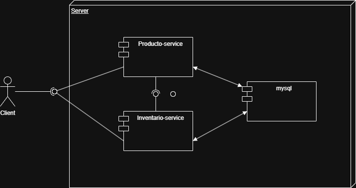
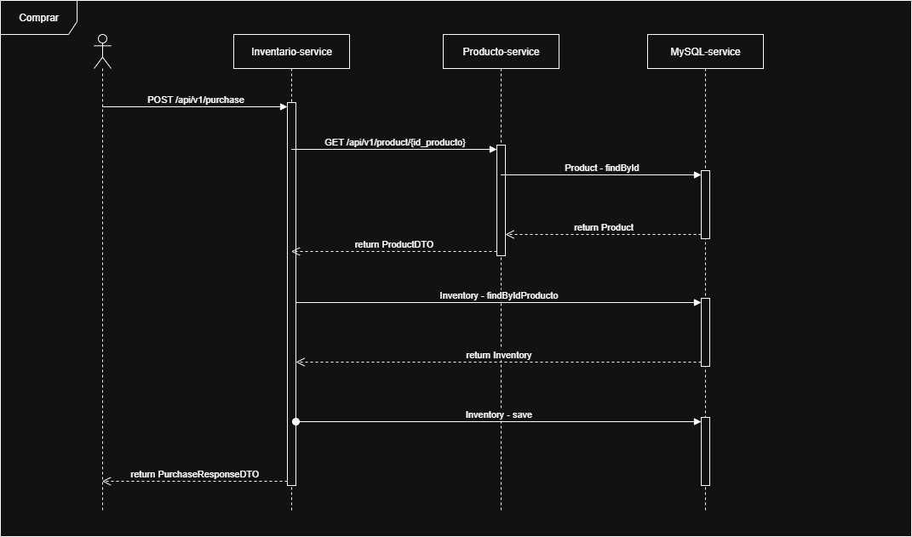

# Despliegue
1. Instalar git.
2. Subir el servicio de docker y docker compose.
3. Descargar el proyecto con `git clone https://github.com/JonaCaste/basic-microservices`.
4. Compilar los dos microservicios
    * Ingresar a la carpeta del microservicio de productos con `cd producto-service`.
        Posteriormente compilamos el proyecto con `mvn clean install -DskipTests`
    * Ingresar a la carpeta del microservicio de inventario con `cd inventario-service`.
        Posteriormente compilamos el proyecto con `mvn clean install -DskipTests`
   
   #### Nota
    * Se compila el proyecto sin pruebas, ya que tenemos propiedades dinámicas (provenientes de docker compose) que generan error.
      Si se necesitan ejecutar las pruebas, se deben descomentar las propiedades de `#dev` del archivo `/resources/application.properties` de cada proyecto; posteriormente se comentan las propiedades dinámicas.

5. Ejecutar: `docker compose up -d` en la carpeta raíz del proyecto.

# Arquitectura
## Diagrama de componentes

## Diagramas de secuencia
* Flujo de compra

# Decisiones de diseño
## Arquitectura General
El sistema se diseñó bajo una arquitectura de microservicios con el objetivo de garantizar escalabilidad, mantenibilidad y separación de responsabilidades. Se utilizaron contenedores Docker para cada uno de los servicios, y la comunicación entre ellos se maneja a través de HTTP. La orquestación de los servicios se realiza con Docker Compose, permitiendo entornos replicables y consistentes tanto en desarrollo como en producción.
## Base de datos
Se seleccionó una base de datos relacional (SQL) como motor de persistencia para el sistema. Esta decisión se fundamenta en las siguientes razones:
* Modelado de relaciones: El dominio del negocio requiere una estructura de datos altamente relacional (e.g., productos, inventario), lo cual es manejado de forma eficiente por una base de datos relacional.
* Consistencia transaccional: Las operaciones críticas como compras, actualizaciones de stock y validaciones de disponibilidad requieren transacciones ACID para mantener la integridad de los datos.
## Gestión de Compras
Se tomó la decisión de centralizar la lógica de compras dentro del microservicio de Inventario. Esta decisión responde a una alineación directa con el dominio y los principios de Diseño Orientado al Dominio (DDD), se justifica:
* Encapsulamiento del dominio: Las operaciones de compra implican directamente la verificación y modificación del inventario. Mantener esta lógica en el microservicio de inventario permite encapsular completamente las reglas de negocio asociadas.
* Evita dependencia entre servicios: Al no dividir la lógica de compra en múltiples microservicios, se reduce el acoplamiento entre servicios y se evita generar flujos innecesarios de comunicación.
* Facilidad para aplicar políticas de negocio: Este diseño permite incluir validaciones como stock mínimo u otras reglas de negocio directamente en el microservicio.
## Contenerización y Orquestación
Todo el ecosistema del sistema ha sido contenizado utilizando Docker, y orquestado mediante un archivo `docker-compose.yml`, esto se justifica con:
* Aislamiento de entornos: Cada microservicio se ejecuta en su propio contenedor, lo que evita conflictos de dependencias y asegura consistencia entre entornos de desarrollo, prueba y producción.
* Escalabilidad modular: Permite escalar los servicios de forma independiente según la carga y las necesidades del sistema.
* Facilidad de despliegue: docker-compose facilita la orquestación del entorno completo con un solo comando, reduciendo el tiempo de configuración manual.
## Seguridad
Para asegurar el acceso a los endpoints críticos del sistema, se integró Spring Security en los microservicios. La autenticación y autorización se manejan mediante una API Key (header). Las razones detrás de esta decisión son:
* Simplicidad y rapidez de implementación para entornos donde no se requiere autenticación basada en usuarios o tokens JWT complejos.
* Aislamiento del tráfico no autorizado desde el cliente externo, sin necesidad de acoplarse a un sistema de gestión de identidades.

# Documentación postman 
Documentación: `https://documenter.getpostman.com/view/38247252/2sB34mjeQX`
